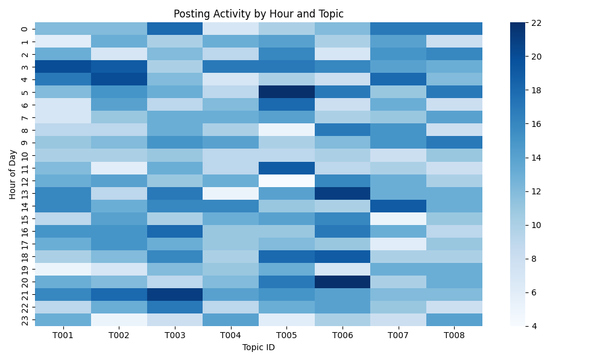
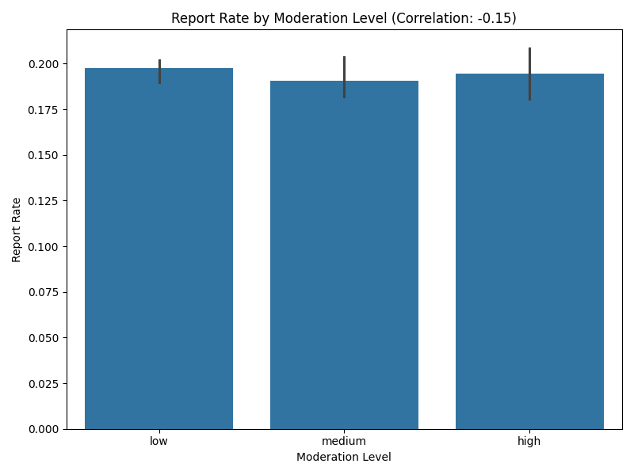
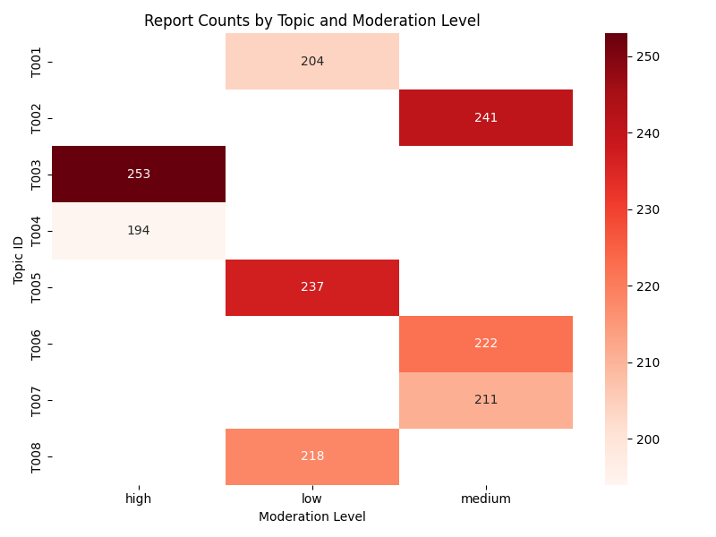
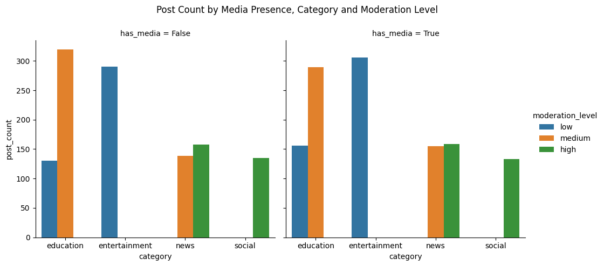

# Social Media Moderation Analytics

## Project Overview

This project is a Python-based social media moderation analytics system designed to process, analyse and visualise moderation-related data.

The system combines data preprocessing, statistical analysis, data visualisation, JSON persistence and an interactive Tkinter interface to explore patterns in social media moderation activity.

The project demonstrates an end-to-end Python workflow from raw data processing to interactive analytical outputs.

## Project Objectives

- Clean and integrate social media datasets
- Transform raw data into analysis-ready structures
- Analyse patterns in content moderation and user reports
- Explore relationships between moderation levels and reporting behaviour
- Generate statistical summaries and visualisations
- Store processed data using JSON
- Provide an interactive desktop interface using Tkinter
- Maintain an audit log of user interactions
- Consider responsible and transparent use of automated moderation analytics

## Key Features

- Data loading and preprocessing with Pandas
- Data cleaning and dataset integration
- Statistical and categorical analysis
- Correlation analysis
- Data visualisation with Matplotlib
- JSON data persistence
- Interactive Tkinter GUI
- Event-driven user interactions
- Audit logging
- Modular Python implementation

## Data Transformation

The analytics pipeline transforms raw social media data into structured, analysis-ready datasets using Pandas.

### Before Transformation

The source data contains fields describing posts, users, topics, moderation settings and reporting activity. Raw records require cleaning and integration before they can be used reliably for analysis.

Example structure:

| post_id | user_id | topic_id | category | has_media | moderation_level | reported |
|---|---|---|---|---|---|---|
| P001 | U001 | T003 | education | True | medium | 0 |

### After Transformation

The processing pipeline cleans and combines relevant datasets, validates fields and derives structures required for statistical analysis and visualisation.

Example analysis-ready structure:

| topic_id | category | has_media | moderation_level | post_count | report_rate |
|---|---|---|---|---:|---:|
| T003 | education | True | medium | 156 | 0.19 |

Key transformation steps include:

- Loading structured source datasets
- Cleaning and validating records
- Combining related datasets
- Converting fields into appropriate data types
- Aggregating posting and reporting activity
- Creating analysis-ready variables for statistical analysis
- Preparing processed records for JSON persistence

## Analysis Results

The analytics pipeline generates several visualisations to explore posting behaviour, moderation patterns and user reporting activity.

### Posting Activity by Hour and Topic

This heatmap shows how posting activity varies across topics throughout the day.



### Report Rate by Moderation Level

Report rates were compared across low, medium and high moderation levels. The observed correlation was approximately **-0.15**, indicating only a weak negative relationship in this dataset.



### Report Counts by Topic and Moderation Level

This heatmap highlights differences in report volumes across topics and moderation levels.



### Media Presence, Category and Moderation Level

Posts were also compared by media presence, content category and moderation level.



## Performance & Reliability

The analytics pipeline includes lightweight execution-time monitoring to support performance evaluation and reproducibility.

Runtime measurements are recorded for key processing stages, including:

- Data loading
- Data cleaning
- Data transformation
- JSON backup generation
- Overall pipeline execution

Prepared datasets are cached during an application session to avoid unnecessary repeated loading, cleaning and merging operations.

This provides a foundation for evaluating latency and throughput as dataset size increases. For larger-scale or edge-case workloads, further benchmarking could measure records processed per second, memory usage and performance under increasing data volumes.

## GUI Design

The Tkinter dashboard uses a task-oriented layout that groups controls by workflow stage.

### Interaction Design

The interface supports three primary interaction patterns:

- **Data preparation** — load, clean and transform datasets through clearly grouped controls.
- **Analysis** — select an engagement metric and run statistical or visual analysis.
- **Full workflow execution** — run the complete moderation analytics pipeline and review audit-log feedback.

The design follows several usability principles, including consistency, clear system feedback and recognition rather than recall. Predefined controls and metric selections reduce manual input and help users follow the analysis workflow.

The audit log provides immediate feedback on system actions, processing results and errors, improving transparency during execution.

### Alternative Interfaces

A command-line interface could offer greater flexibility for technical users but would provide less visual guidance.

A web dashboard could support richer visualisation and remote access, but would introduce additional deployment and architectural complexity.

Tkinter was selected for this prototype because it provides a lightweight desktop interface while keeping the analytical workflow easy to run locally.

## Technologies & Skills

- Python
- Pandas
- NumPy
- Matplotlib
- Tkinter
- JSON
- Data Cleaning
- Data Transformation
- Statistical Analysis
- Data Visualisation
- Event-Driven Programming
- GUI Development
- Audit Logging
- Responsible Data Analytics

## How to Run

Install the required Python packages:

```bash
pip install -r requirements.txt
```

Place the required source datasets in a `raw_data/` folder at the project root:

```text
raw_data/
├── USERS.csv
├── POSTS.csv
├── INTERACTIONS.csv
└── TOPICS.csv
```

Run the interactive dashboard:

```bash
python src/gui.py
```

Or run the analytics pipeline directly:

```bash
python src/main.py
```

Generated visualisations are saved to the `outputs/` folder.

## Disclaimer

This repository is a portfolio project demonstrating Python programming, data analytics and software development concepts using a social media moderation scenario.

The system is intended for portfolio demonstration purposes and should not be used as an automated moderation or decision-making system in real-world environments.
